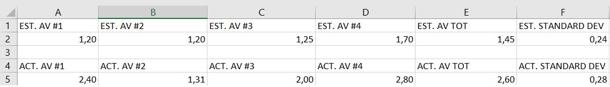

TEMPLATE FOR RETROSPECTIVE (Team 11)
=====================================

The retrospective should include _at least_ the following
sections:

- [process measures](#process-measures)
- [quality measures](#quality-measures)
- [general assessment](#assessment)

## PROCESS MEASURES 

### Macro statistics

- Number of stories committed vs. done (7 vs 3)
- Total points committed vs. done (31 vs 15)
- Nr of hours planned vs. spent (as a team) (30 vs 46)

**Remember** a story is done ONLY if it fits the Definition of Done:
 
- Unit Tests passing
- Code review completed
- Code present on VCS
- End-to-End tests performed

> Please refine your DoD if required (you cannot remove items!) 

### Detailed statistics

| Story  | # Tasks | Points | Hours est. | Hours actual |
|--------|---------|--------|------------|--------------|
| _#0_   |    5    |       |     6       |    12     |
| _#1_      |     8    |    5    |      9.5      |      10.5        |
| _#2_      |     4    |    2    |      5      |      8        |
| _#3_      |     5    |    8    |      8.5      |     14        |
   

> place technical tasks corresponding to story `#0` and leave out story points (not applicable in this case)

- Hours per task average, standard deviation (estimate and actual)

- Total task estimation error ratio: sum of total hours estimation / sum of total hours spent - 1 (29/44.5 -1 = 0.67)

  
## QUALITY MEASURES 

- Unit Testing:
  - Total hours estimated
  - Total hours spent
  - Nr of automated unit test cases 
  - Coverage (if available)
- E2E testing:
  - Total hours estimated (1)
  - Total hours spent (2.5)
- Code review 
  - Total hours estimated (1)
  - Total hours spent (1)
  

## ASSESSMENT

- What caused your errors in estimation (if any)?  
The front-end part.

- What lessons did you learn (both positive and negative) in this sprint?  

  Better awareness of the team vs Definition of done.

- Which improvement goals set in the previous retrospective were you able to achieve?  
?
  
- Which ones you were not able to achieve? Why?  
?

- Improvement goals for the next sprint and how to achieve them (technical tasks, team coordination, etc.)  

  Division by code modules (both front-end and back-end about one single task) thanks to a better knowledge of the skills of each member of the group.

> Propose one or two

- One thing you are proud of as a Team!!  
Quiet work environment 